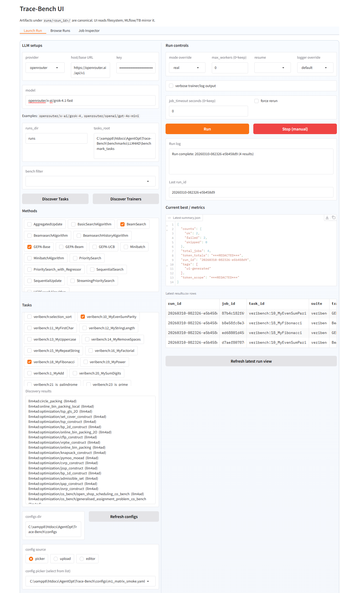
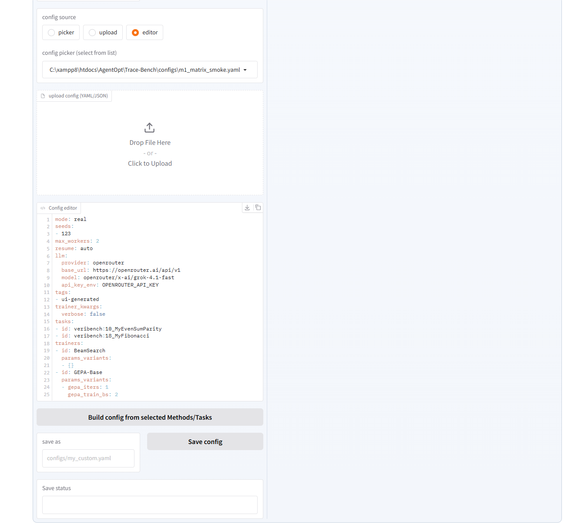
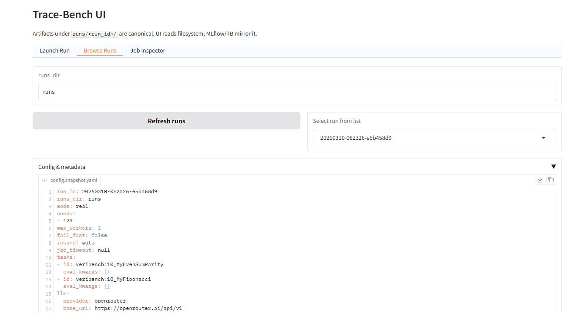
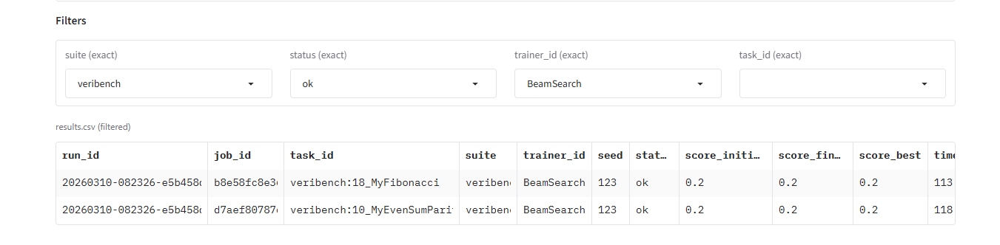
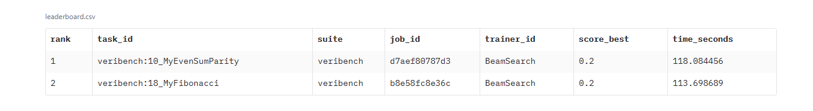
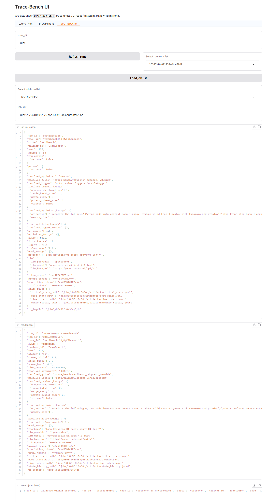
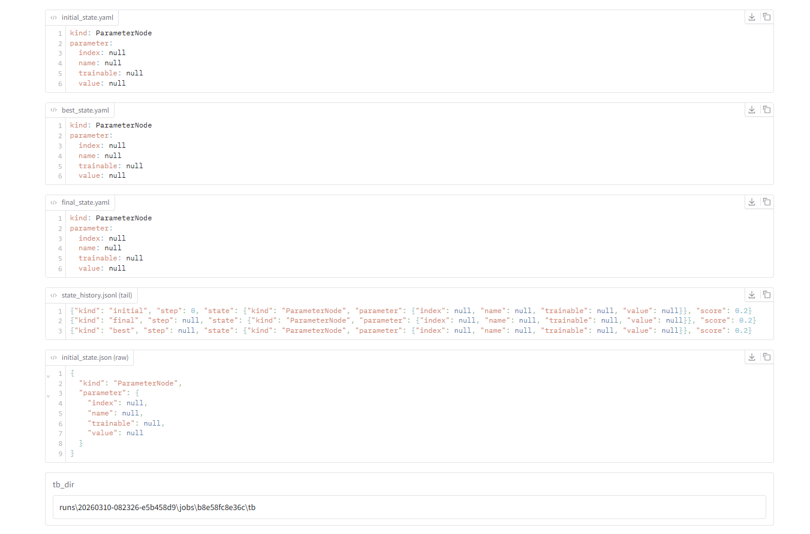

# Gradio UI Guide

Trace-Bench ships a Gradio web interface for launching runs, browsing results,
and inspecting individual jobs -- all without touching the command line after
the initial launch.

## Launch

```bash
trace-bench ui --runs-dir runs
```

Options:

| Flag | Default | Purpose |
|------|---------|---------|
| `--runs-dir` | `runs` | Root directory that holds run output folders |
| `--tasks-root` | auto-detected | Path to benchmark task definitions |
| `--share` | `False` | Create a public Gradio link (auto-enabled on Colab) |
| `--port` | Gradio default | Override the server port |

The UI opens three tabs: **Launch Run**, **Browse Runs**, and **Job Inspector**.

---

## Tab 1: Launch Run



The left panel configures the LLM provider and selects what to run.
The right panel sets execution overrides and shows live results.

### LLM setup

Choose a **provider** (`openai`, `openrouter`, or `custom`). The base URL,
API key field, and model placeholder update automatically. API keys entered
here are applied as environment variables for the duration of the run.

### Task and trainer discovery

Click **Discover Tasks** or **Discover Trainers** to populate the checkbox
lists. Use the **bench filter** dropdown (`llm4ad`, `veribench`, etc.) to
narrow the task list. Selected tasks and trainers feed into the config editor.

### Config source

Select one of three sources via the **config source** radio:

- **picker** -- choose a YAML file from the `configs/` directory dropdown.
- **upload** -- drag-and-drop a local YAML/JSON file.
- **editor** -- write or modify YAML directly in the code editor.

Click **Build config from selected Methods/Tasks** to auto-generate a config
from the checkbox selections. The editor always shows the final YAML that will
be executed.



### Run controls

| Control | Purpose |
|---------|---------|
| **mode override** | Force `stub` or `real` regardless of config |
| **max_workers** | Override concurrency (`0` = keep config value) |
| **resume** | Override resume mode (`auto`, `failed`, `none`) |
| **logger override** | Replace the logger for every trainer (e.g. `TensorboardLogger`) |
| **job_timeout** | Per-job timeout in seconds (`0` = keep config value) |
| **force rerun** | Re-execute all jobs, ignoring prior results |
| **verbose trainer** | Enable verbose logging output |

Press **Run** to start. The **Run log** textbox and **Latest summary.json**
panel update when the run finishes. **Refresh latest run view** reloads the
most recent run at any time.

---

## Tab 2: Browse Runs



Select a completed run from the dropdown. The tab loads:

- **Config & metadata** (accordion): `config.snapshot.yaml`, `env.json`,
  `summary.json`, `manifest.json`, `files_index.json`.
- **Filters**: dropdowns for `suite`, `status`, `trainer_id`, and `task_id`.
  Changing any filter updates the results table and leaderboard instantly.



- **results.csv (filtered)**: all job rows matching the current filters.
- **leaderboard.csv**: best score per task, ranked.



### TensorBoard

A pre-built TensorBoard command is shown. Click **Start TensorBoard** to
launch it in a background process; the status box shows the URL or the manual
command if auto-launch fails.

### Resume

Select a run and click **Resume selected run** to re-execute failed or
incomplete jobs using the original config snapshot. Check **Create new run_id**
to write results into a fresh directory instead of resuming in-place.

---

## Tab 3: Job Inspector



Select a run, then click **Load job list** to populate the job dropdown.
Selecting a job displays:

| Panel | Source file | Content |
|-------|------------|---------|
| **job_meta.json** | `jobs/<id>/job_meta.json` | Task, trainer, seed, resolved kwargs |
| **results.json** | `jobs/<id>/results.json` | Scores, status, timing, token usage |
| **events.jsonl (head)** | `jobs/<id>/events.jsonl` | First 200 event lines (live progress) |
| **stdout.log (tail)** | `jobs/<id>/stdout.log` | Last 200 lines of captured stdout |
| **initial / best / final state** | `jobs/<id>/artifacts/*.yaml` | State snapshots in YAML |
| **state_history.jsonl** | `jobs/<id>/artifacts/state_history.jsonl` | Full state evolution |
| **tb_dir** | `jobs/<id>/tb/` | TensorBoard log directory for this job |



---

## Following Live Progress (No Terminal Needed)

You can follow a running experiment directly in the UI:

1. Start the run in **Launch Run**. The **Run log** textbox shows the last action.
2. Switch to **Job Inspector**, click **Load job list**, then select a job.
3. Use **Refresh job** to see updated `events.jsonl` and `stdout.log` tails.

This gives you live progress without leaving the UI.

## Where to find live logs (filesystem)

While a run is in progress:

- **events.jsonl** -- each job appends structured JSON events as they happen.
  Tail this file for real-time progress.
- **stdout.log** -- captured standard output per job.
- **summary.json** and **results.csv** -- written/updated at the run level
  after each job completes.

```bash
# Watch events for a specific job
tail -f runs/<run_id>/jobs/<job_id>/events.jsonl
```

---

## Common workflows

1. **Quick smoke test**: pick `configs/smoke.yaml` from the picker, set mode
   to `stub`, press Run.
2. **Build a custom config**: discover tasks/trainers, check the ones you want,
   click **Build config**, tweak in the editor, then Run.
3. **Compare trainers**: after a multi-trainer run, use the Browse Runs tab
   filters to compare `trainer_id` values side by side.
4. **Debug a failure**: open the Job Inspector, select the failed job, and
   read `events.jsonl` and `stdout.log`.

---

## Related

- Notebook walkthrough: `notebooks/04_gradio_ui.ipynb`
- [Config Reference](config-reference.md) -- YAML schema and matrix semantics
- [Result Analysis](result-analysis.md) -- deeper analysis workflows
